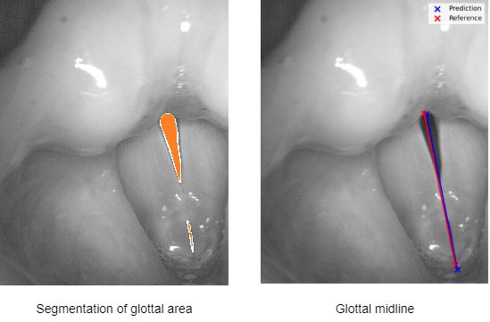

.. GlottisNetV2 documentation master file, created by
   sphinx-quickstart on Mon Nov 15 15:12:29 2021.
   You can adapt this file completely to your liking, but it should at least
   contain the root `toctree` directive.

Welcome to GlottisNetV2 documentation!
======================================

This documentation provides information on the installation and the training of GlottisNetV2, an architecture for the simultaneous predcition of the glottal area and the glottal midline.

.. toctree::
    :maxdepth: 3
    :caption: User Guide
    :glob:

    modules/Introduction
    modules/Models
    modules/Data
    modules/Software
    

.. toctree::
    :maxdepth: 3
    :caption: Developer Guide
    :glob:

    modules/DataGenerators
    modules/Training

    

