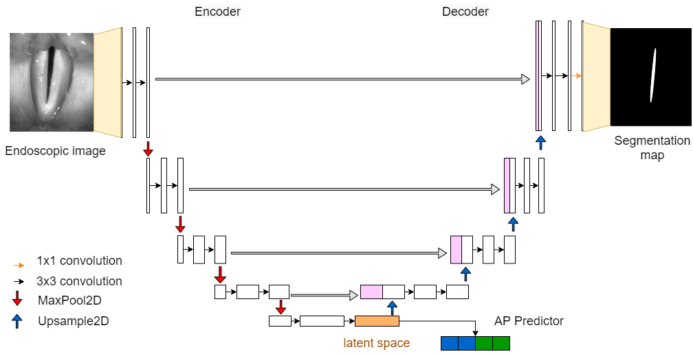
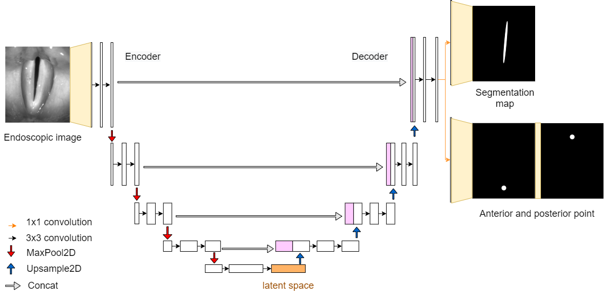
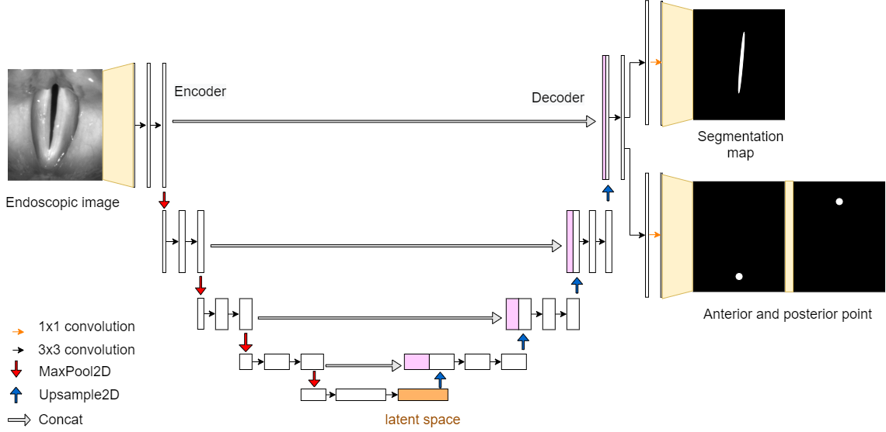
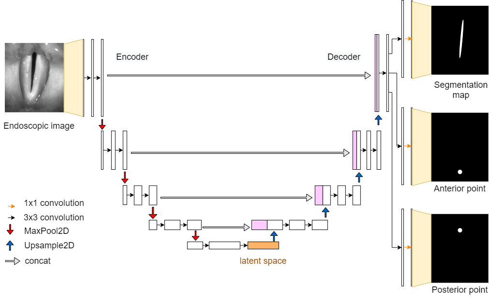
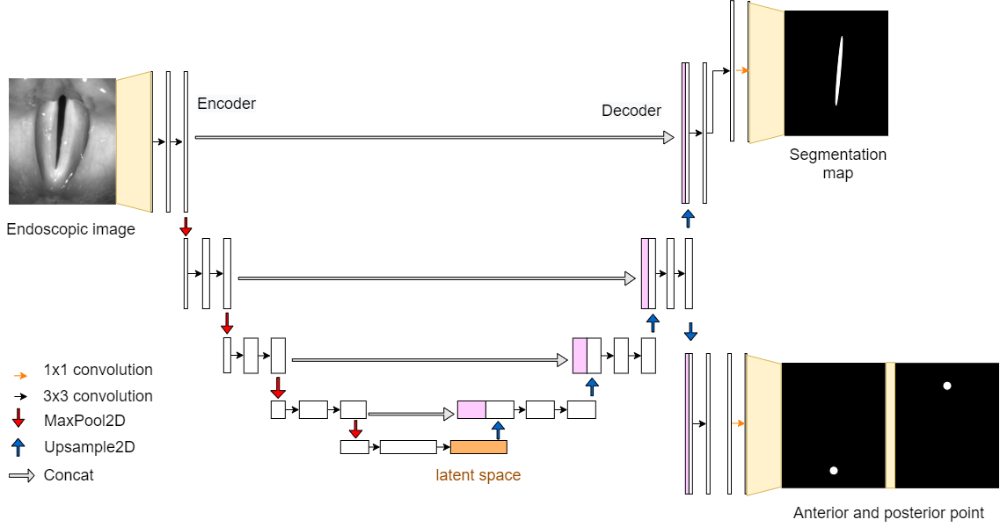
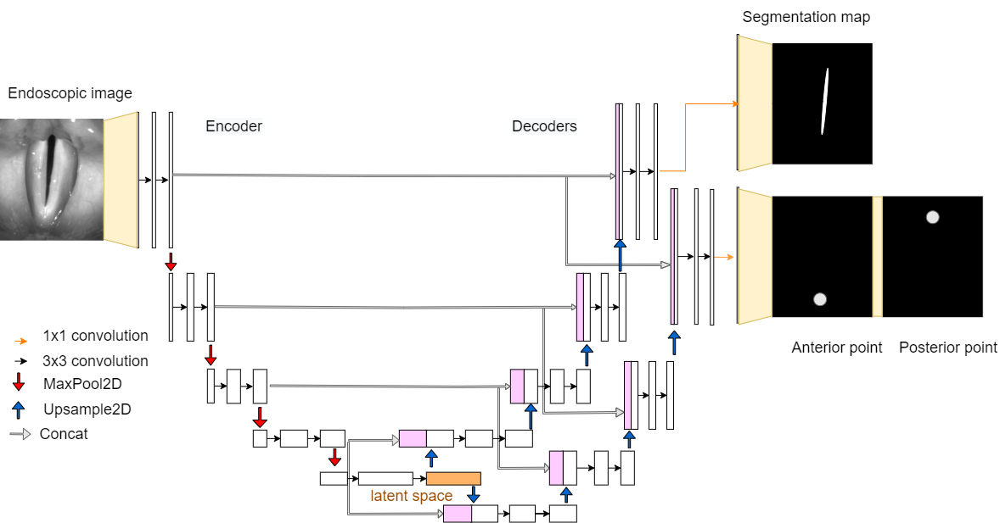
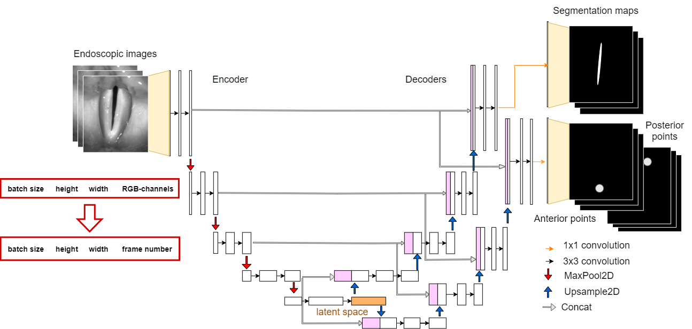
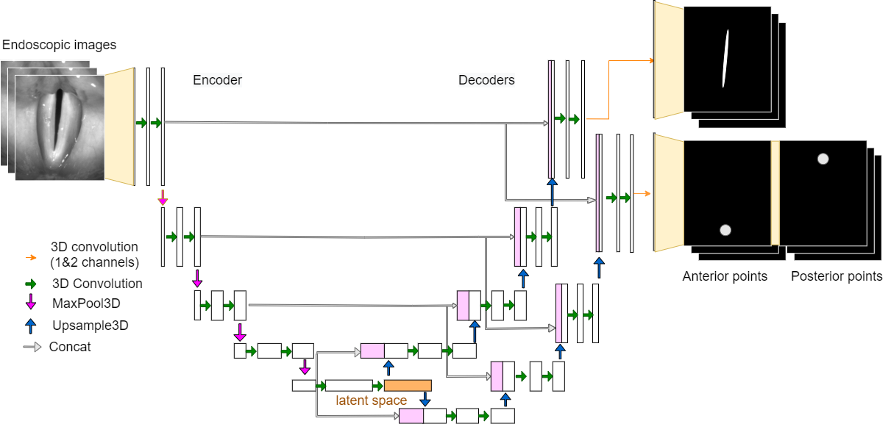
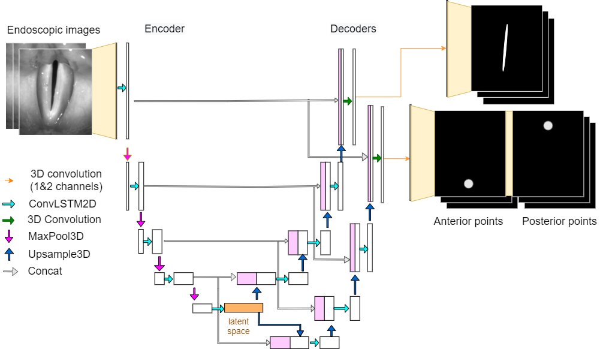

.. _models: 

Models
******
GlottisNet was introduced by Kist et al. (Rethinking glottal midline detection 2020). The neural network has a U-Net structure and two
outputs. It predicts the segmentation of the glottal area and the anterior and posterior
points. The anterior and posterior points are then used to determine the glottal midline.

GlottisNetV1
--------------

GlottisNetV1 is the original architecture introduced by Kist et al. The segmentation of the glottal area is returned
at the end of the decoding path of the U-Net. The coordinates of anterior and posterior points are estimated from the
latent space using a regression. The network then returns the two coordinates.

GlottisNetV2a
-------------

GlottisNetV2a is the first neural network of the new generation of GlottisNet. It uses prediction maps instead of
solving a regression problem. The segmentation of the glottal area and the prediction maps are returned at the end of
the decoder as two outputs. The prediction maps of the anterior and posterior points are stored in a seperate channel.

GlottisNetV2b
-------------

GlottisNetV2b has a separate convolutional layer for the segmentation of the glottal area and anterior and posterior point prediction at the end of the decoder.

GlottisNetV2c
-------------

GlottisNetV2c has three outputs: Prediction map for anterior point, prediction map for posterior point and segmentation of the glottal
area.

GlottisNetV2d
-------------

GlottisNetV2d already separates the task of segmenting the glottal area and prediction of anterior an posterior point in 
the last layer of the decoder.

GlottisNetV2e
-------------

GlottisNetV2e has two separate decoders for the prediction of anterior and posterior point prediction and the segmentation 
of the glottal area.

GlottisNetV2_Channels
---------------------

GlottisNetV2_Channels is designed to take multiple frames as input. The number of frames is fixed before the training (3, 6, 9 or 12 frames). The frames are stored in the channel
dimension of the input images.

GlottisNetV2_3DConv
-------------------

GlottisNetV2_3DConv includes multiple frames by 3D convolution. The number of input frames is fixed (3, 6, 9 or 12 frames). The input image
is 5-dimensional: (batch, frames, width, height, channels).

GlottisNetV2_LSTM
-----------------

GlottisNetV2LSTM uses LSTM modules to include multiple frames. There is one ConvLSTM2D layer per layer in the U-Net. Due to memory
limitations during training, the last layer of the decoder consists of 3D-convolutional layers instead of ConvLSTM2D layers.

